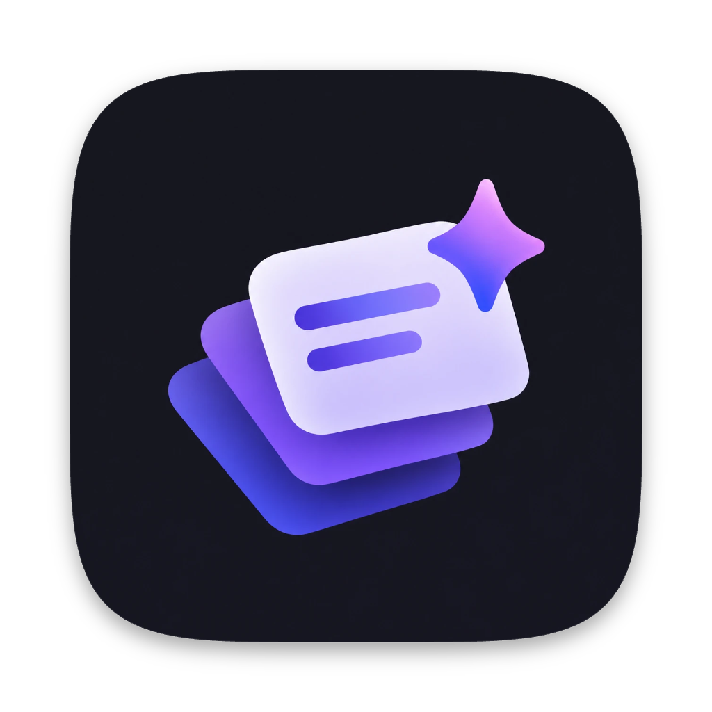
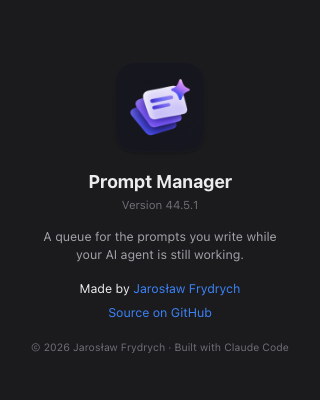
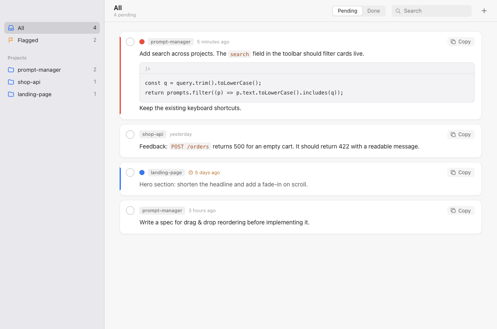

<p align="center">
  
</p>

<h1 align="center">Prompt Manager</h1>

<p align="center">
  A native-feeling macOS app for the prompts you write while your AI agent is still working.
</p>

<p align="center">
  
</p>

## What it is

When you build with AI coding agents (Claude Code, OpenCode, Codex…) and spec-driven workflows, the next prompt is usually written
while the agent is still busy with the current one: a piece of feedback, the next feature, a fix you just noticed.
Prompt Manager is the place where those prompts wait their turn.

- **One queue per project.** A Mail-style sidebar with projects and a pending count on each.
  The **All** and **Flagged** views show everything at once.
- **Prompts are text blocks.** Click to edit, `⌘↩` to save. Fenced ```` ``` ```` code blocks and `` `inline code` `` are rendered.
- **Copy, paste, done.** One click copies the whole prompt for your harness, and `⌥`-click also marks it as done.
  Done prompts move to a **Done** tab, where you can restore them.
- **See what's getting old.** Every prompt shows when it was written. Anything older than 3 days gets an orange badge, because it may be outdated.
- **Finder-style flags.** Right-click a prompt to give it a red, orange, yellow, green, blue, purple or gray flag.
- **Drag & drop.** Reorder projects and prompts. To move a prompt to another project, drop it on that project
  or click the project name on the card.
- **Light & dark.** Follows the system appearance.
- **Local only.** Everything is stored in one JSON file on your Mac. The app makes no network requests.

<p align="center">
  
</p>

## Install

Download the latest `Prompt-Manager-<version>-arm64.dmg` from
[Releases](https://github.com/jaroslawfrydrych/prompt-manager/releases) and drag the app to **Applications**.
The build is for Apple Silicon.

The app is not notarized by Apple, so macOS will block the first launch. To open it anyway:

- go to **System Settings → Privacy & Security** and click **Open Anyway**, or
- run `xattr -dr com.apple.quarantine "/Applications/Prompt Manager.app"`.

## Keyboard shortcuts

| Shortcut | Action |
|---|---|
| `⌘N` | New prompt |
| `⇧⌘N` | New project |
| `⌘1`–`⌘9` / `⌘0` | Jump to project / All |
| `⌘F` | Search |
| `⌘↩` / `Esc` | Save / cancel editing |
| `⌥`-click **Copy** | Copy and mark as done |

To rename a project, double-click it. Right-click a prompt to flag, move or delete it.

## Development

```bash
npm install
npm start          # run the app
npm run smoke      # UI smoke test against a temporary data file
npm run dmg        # build dist/Prompt-Manager-<version>-arm64.dmg
```

Plain Electron with vanilla HTML/CSS/JS and no frameworks. Data is stored in
`~/Library/Application Support/Prompt Manager/data.json` and every save is written atomically.

The GitHub Actions workflow builds the DMG on every push to `master`, where you can download it as a workflow artifact.
Pushing a `v*` tag publishes it as a GitHub Release:

```bash
git tag v1.0.0 && git push origin v1.0.0
```

## Author

Made by [Jarosław Frydrych](https://github.com/jaroslawfrydrych), built with the help of
[Claude Code](https://claude.com/claude-code) (AI-assisted development).
